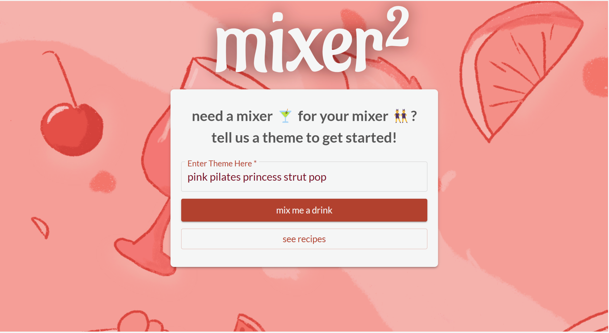
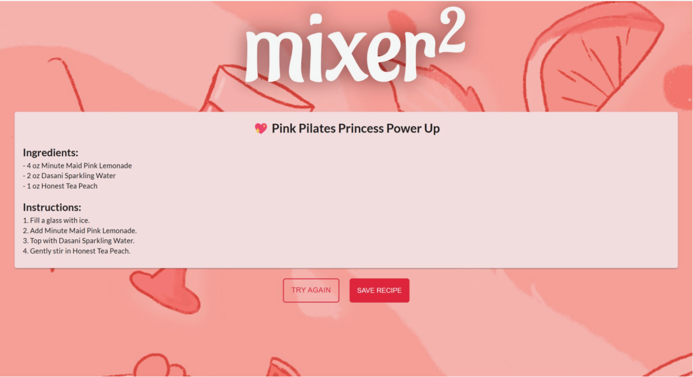
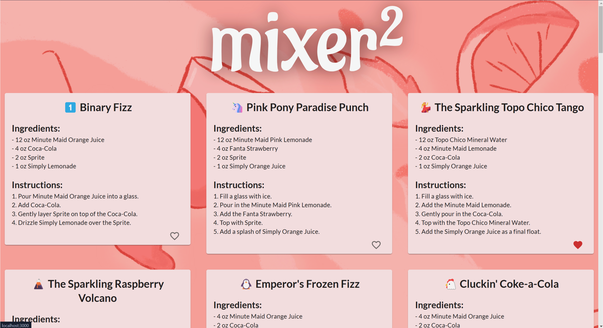

<!-- Improved compatibility of back to top link: See: https://github.com/othneildrew/Best-README-Template/pull/73 -->
<a id="readme-top"></a>
<!--
*** Thanks for checking out the Best-README-Template. If you have a suggestion
*** that would make this better, please fork the repo and create a pull request
*** or simply open an issue with the tag "enhancement".
*** Don't forget to give the project a star!
*** Thanks again! Now go create something AMAZING! :D
-->


<!-- PROJECT SHIELDS -->
<!--
*** I'm using markdown "reference style" links for readability.
*** Reference links are enclosed in brackets [ ] instead of parentheses ( ).
*** See the bottom of this document for the declaration of the reference variables
*** for contributors-url, forks-url, etc. This is an optional, concise syntax you may use.
*** https://www.markdownguide.org/basic-syntax/#reference-style-links
-->


<!-- PROJECT LOGO -->
<br />
<div align="center">
  <a href="https://github.com/sachiverma0/mixermixer">
    
  </a>
</div>


A web app that turns a party theme into a custom drink recipe. Enter a theme, get a Gemini-generated recipe built around Coca-Cola products, save the ones you like, and browse them later in a catalog.

Built at Georgetown HoyaHacks by a team of four → **[Devpost](https://devpost.com/software/table-61-mixer-mixer)**







## Features

- Enter a party theme on the homepage and generate a matching drink recipe
- Recipes are generated by the Google Gemini API and constrained to Coca-Cola products
- Save generated recipes to a MongoDB Atlas database
- Browse saved recipes in a catalog and mark favorites

## Tech stack

| Layer | Tech |
|---|---|
| Frontend | React |
| Backend | Python, Flask |
| Database | MongoDB Atlas (PyMongo) |
| Generation | Google Gemini API (Google GenAI SDK) |

## How it works

The React frontend sends the user's theme to a Flask endpoint. The backend prompts Gemini for a themed recipe in a predictable format, parses the response into a standardized JSON schema, and returns it to the client. Saved recipes are written to MongoDB Atlas, whose document model suits the semi-structured shape of recipe data. The API key stays server-side and is never exposed to the browser.

## Running locally

**Prerequisites:** Node.js, Python 3.8+, a Google Gemini API key, and a MongoDB Atlas connection string.

```bash
git clone https://github.com/sachiverma0/mixer-mixer.git
cd mixer-mixer
```

Create a `.env` file in the backend directory:

```
GEMINI_API_KEY=your_key_here
MONGODB_URI=your_connection_string_here
```

Start the backend:

```bash
pip install -r requirements.txt
python app.py
```

Start the frontend in a second terminal:

```bash
cd frontend
npm install
npm start
```

The app runs at `http://localhost:3000`.

## Team

- **Sachi Verma** — Built the Flask endpoint that receives requests from the frontend, called the Google GenAI SDK with the API key kept server-side, and parsed Gemini's output into a standardized JSON response
- **Julia** — MongoDB Atlas integration via PyMongo; implemented create, read, and update operations
- **Leeann** — Designed the user interface for all pages; built the React frontend and its HTTP communication with the backend
- **Simran** — Frontend UI design in HTML/CSS/React; GitHub and Devpost management

Github Repository forked from https://devpost.com/software/table-61-mixer-mixer

<!-- MARKDOWN LINKS & IMAGES -->
<!-- https://www.markdownguide.org/basic-syntax/#reference-style-links -->
[contributors-shield]: https://img.shields.io/github/contributors/sachiverma0/mixermixer.svg?style=for-the-badge
[contributors-url]: https://github.com/sachiverma0/mixermixer/graphs/contributors
[forks-shield]: https://img.shields.io/github/forks/sachiverma0/mixermixer.svg?style=for-the-badge
[forks-url]: https://github.com/sachiverma0/mixermixer/network/members
[stars-shield]: https://img.shields.io/github/stars/sachiverma0/mixermixer.svg?style=for-the-badge
[stars-url]: https://github.com/sachiverma0/mixermixer/stargazers
[issues-shield]: https://img.shields.io/github/issues/sachiverma0/mixermixer.svg?style=for-the-badge
[issues-url]: https://github.com/sachiverma0/mixermixer/issues
[license-shield]: https://img.shields.io/github/license/sachiverma0/mixermixer.svg?style=for-the-badge
[license-url]: https://github.com/sachiverma0/mixermixer/blob/master/LICENSE.txt
[linkedin-shield]: https://img.shields.io/badge/-LinkedIn-black.svg?style=for-the-badge&logo=linkedin&colorB=555
[linkedin-url]: https://linkedin.com/in/sachiverma06
[product-screenshot]: images/screenshot.png
<!-- Shields.io badges. You can a comprehensive list with many more badges at: https://github.com/inttter/md-badges -->
[Next.js]: https://img.shields.io/badge/next.js-000000?style=for-the-badge&logo=nextdotjs&logoColor=white
[Next-url]: https://nextjs.org/
[React.js]: https://img.shields.io/badge/React-20232A?style=for-the-badge&logo=react&logoColor=61DAFB
[React-url]: https://reactjs.org/
[Vue.js]: https://img.shields.io/badge/Vue.js-35495E?style=for-the-badge&logo=vuedotjs&logoColor=4FC08D
[Vue-url]: https://vuejs.org/
[Angular.io]: https://img.shields.io/badge/Angular-DD0031?style=for-the-badge&logo=angular&logoColor=white
[Angular-url]: https://angular.io/
[Svelte.dev]: https://img.shields.io/badge/Svelte-4A4A55?style=for-the-badge&logo=svelte&logoColor=FF3E00
[Svelte-url]: https://svelte.dev/
[Laravel.com]: https://img.shields.io/badge/Laravel-FF2D20?style=for-the-badge&logo=laravel&logoColor=white
[Laravel-url]: https://laravel.com
[Bootstrap.com]: https://img.shields.io/badge/Bootstrap-563D7C?style=for-the-badge&logo=bootstrap&logoColor=white
[Bootstrap-url]: https://getbootstrap.com
[JQuery.com]: https://img.shields.io/badge/jQuery-0769AD?style=for-the-badge&logo=jquery&logoColor=white
[JQuery-url]: https://jquery.com 
